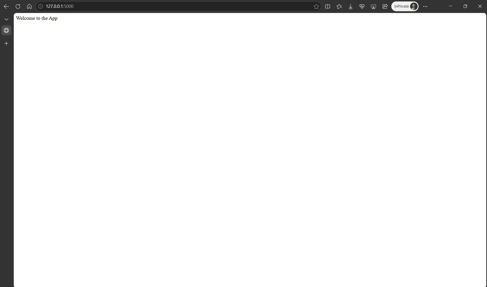
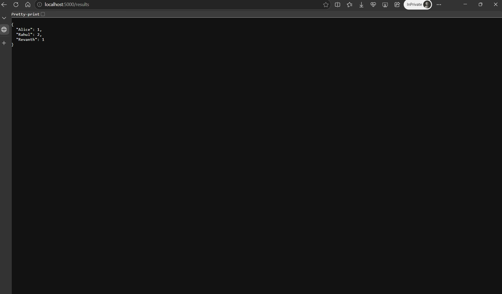
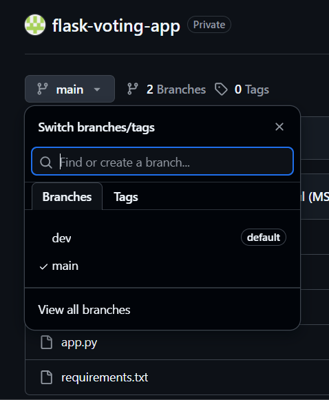
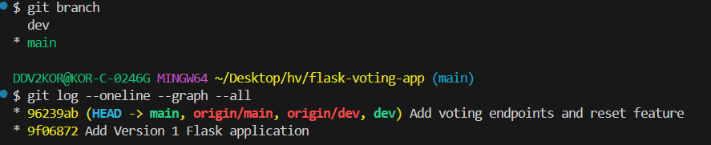

# Flask Voting Application

This project is a simple voting application where users can vote for candidates using a web address. Each candidate gets a vote whenever someone visits their voting address. The application also lets users see the current voting results. A reset option is provided to clear all votes.

## Installation and Setup

### 1. Clone the repository

```bash
git clone YOUR_GITHUB_REPOSITORY_URL
```

### 2. Move into the project folder

```bash
cd flask-voting-app
```

### 3. Create a virtual environment

```bash
python -m venv venv
```

### 4. Activate the virtual environment

On Windows:

```bash
venv\Scripts\activate
```

On macOS/Linux:

```bash
source venv/bin/activate
```

### 5. Install Flask

```bash
pip install -r requirements.txt
```

### 6. Run the application

```bash
python app.py
```

The application will run at:

```text
http://localhost:5000/
```

## API Endpoint Reference

| Endpoint       | Method | Description                                     | Example Response                                  |
| -------------- | ------ | ----------------------------------------------- | ------------------------------------------------- |
| `/`            | GET    | Displays the welcome message                    | `Welcome to the App`                              |
| `/health`      | GET    | Checks whether the application is running       | `App is running`                                  |
| `/vote/<name>` | GET    | Records one vote for the specified candidate    | `{"message":"Vote recorded for Rahul","votes":1}` |
| `/results`     | GET    | Shows the current vote count for all candidates | `{"Alice":1,"Rahul":2,"Revanth":1}`                             |
| `/reset`       | GET    | Clears all stored votes                         | `{"message":"All votes have been reset"}`         |

### Voting Example

Open:

```text
http://localhost:5000/vote/Rahul
```

This records one vote for Rahul.

Opening the same URL again increases Rahul's vote count.

To see the results, open:

```text
http://localhost:5000/results
```

## Git Workflow

The project uses two branches:

* `dev` — used for development and testing
* `main` — contains stable and completed versions

Development was performed in the `dev` branch. After a version was completed and tested successfully, the `dev` branch was merged into `main`.

The workflow was:

```text
Create feature
     |
     v
    dev
     |
     | Test application
     |
     v
Merge into main
     |
     v
   GitHub
```

Version 1 was developed and committed on `dev`, then merged into `main`.

Version 2 was developed on top of Version 1 in `dev`, tested, committed, pushed to GitHub, and then merged into `main`.

## Version History

### Version 1

* Created the Flask application
* Added `/` endpoint
* Added `/health` endpoint
* Set up Git repository
* Created `dev` and `main` branches
* Published Version 1 to GitHub

### Version 2

* Added voting functionality
* Added `/vote/<name>` endpoint
* Added `/results` endpoint
* Added `/reset` endpoint
* Tested voting and reset functionality
* Merged Version 2 from `dev` into `main`

## Screenshots

### Application Running in Browser



### Application showing results in Browser



### GitHub Branches



### Version History and Merge History



## Technologies Used

* Python 3
* Flask
* Git
* GitHub
